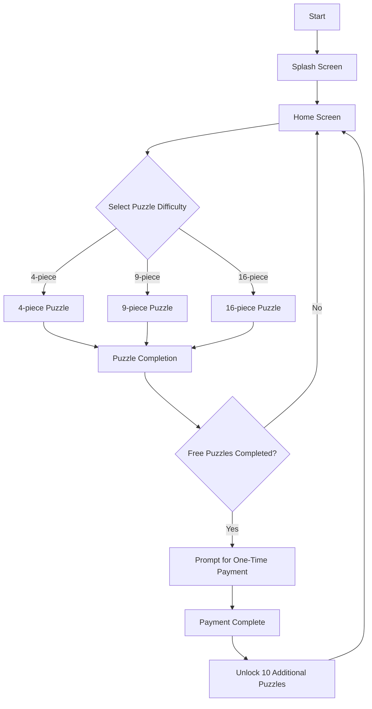
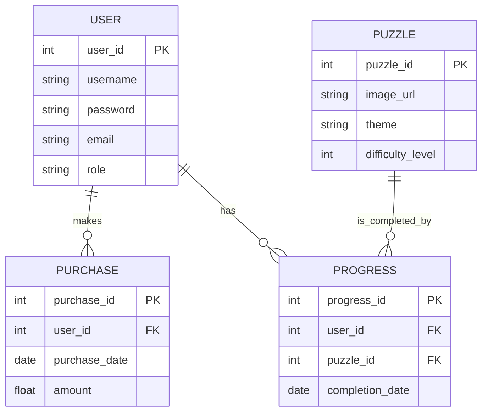
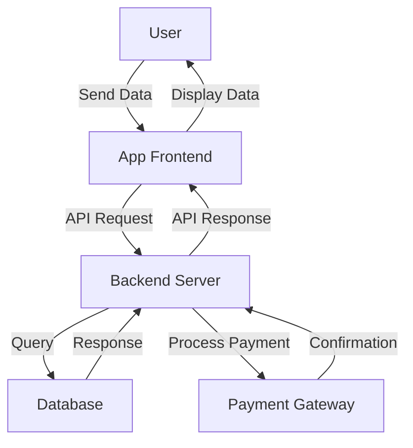
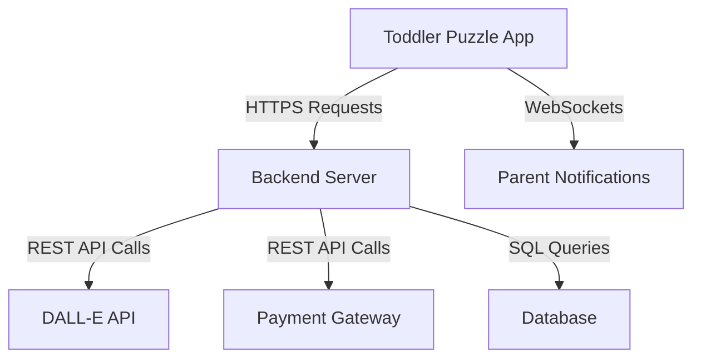

# INTRODUCTION

## PURPOSE

The purpose of this Software Requirements Specification (SRS) document is to provide a comprehensive description of the Toddler Puzzle App. It serves as a detailed guide for developers, testers, project managers, and other stakeholders involved in the design, development, and maintenance of the application. This document outlines the functional and non-functional requirements, ensuring that all parties have a clear understanding of the system's intended functionality and constraints.

## SCOPE

The Toddler Puzzle App is a mobile application aimed at toddlers aged 2-5 years, offering an engaging and educational experience through simple puzzles with varying difficulty levels (4, 9, and 16 pieces). Key functionalities include:

- **AI-Generated Images:** Utilization of AI technologies like DALL-E to create colorful and diverse puzzle images.
- **Puzzle Difficulty Levels:** Multiple levels tailored to different skill sets, promoting cognitive development.
- **One-Time Payment Model:** An affordable pricing strategy allowing access to additional puzzles without recurring subscriptions.
- **Offline Playability:** Capability to play puzzles without an internet connection, ensuring accessibility anytime.
- **Parental Controls:** Features that enable parents to manage content, purchases, and app settings to ensure a safe environment for children.
- **User Interface:** Intuitive and visually appealing design with large icons and simple navigation suitable for toddlers.
- **Admin Controls:** Tools for administrators to approve or delete AI-generated content, maintaining appropriateness and quality.

The app aims to provide a fun and safe platform for toddlers to develop problem-solving skills while giving parents control over the content and purchasing options. Regular updates with new themes and puzzles ensure ongoing engagement and educational value.

# PRODUCT DESCRIPTION

## Product Perspective

The Toddler Puzzle App is a standalone mobile application designed to operate within the iOS and Android ecosystems. It leverages existing AI technologies, specifically integrating with AI image generation APIs such as DALL-E, to provide dynamic and diverse puzzle content. The app interacts with external payment gateways to facilitate the one-time payment model and ensures offline functionality by storing necessary data locally on the device. Additionally, it includes administrative interfaces for content approval and management, positioning it as part of a broader system that includes parent management tools and AI content generation services.

## Product Functions

- **AI-Generated Images:** Integration with AI image generators like DALL-E to create colorful, diverse, and age-appropriate puzzle images.
- **Puzzle Difficulty Levels:** Offers puzzles with 4, 9, and 16 pieces, tailored to different developmental stages of toddlers.
- **One-Time Payment Model:** Allows users to unlock additional content through a single payment of $2 for 10 extra puzzles after completing three free puzzles.
- **Offline Playability:** Enables toddlers to access and complete puzzles without requiring an active internet connection.
- **Parental Controls:** Provides parents with the ability to manage content, control purchases, and adjust app settings to ensure a safe and appropriate environment for children.
- **User Interface:** Features an intuitive, visually appealing design with large icons and simple navigation optimized for toddlers.
- **Admin Controls:** Offers administrative tools to approve or delete AI-generated content, ensuring all images meet quality and appropriateness standards.
- **Regular Updates:** Incorporates monthly updates with new themes and puzzles to maintain engagement and provide ongoing educational value.
- **Notifications:** Sends updates to parents about new themes and puzzles to keep the content fresh and engaging.

## User Characteristics

- **Toddlers (Aged 2-5):** Primary users who interact with the app through a simple and intuitive interface designed for minimal cognitive load. They require large buttons, vibrant colors, and immediate visual and auditory feedback to engage with the puzzles.
- **Parents:** Secondary users who manage app settings, purchases, and monitor their child’s activity. They require a straightforward interface to control parental settings, make purchases, and receive notifications about new content.
- **Administrators:** Users responsible for content management, including the approval or deletion of AI-generated images. They require access to administrative tools and interfaces to maintain the quality and appropriateness of the app’s content.

## Constraints

- **Platform Compatibility:** The app must be fully compatible with both iOS and Android devices, adhering to the respective platform guidelines and limitations.
- **Budgetary Limits:** Development and maintenance must stay within the allocated budget, affecting choices in technology, staffing, and feature implementation.
- **Regulatory Compliance:** Must comply with regulations related to children's online privacy, such as COPPA (Children’s Online Privacy Protection Act), ensuring data protection and safe usage.
- **Performance Requirements:** The app must perform smoothly on a range of devices with varying hardware capabilities, ensuring quick loading times and responsive interactions.
- **AI Integration Limitations:** Dependence on third-party AI services like DALL-E may introduce constraints related to API usage limits, response times, and content quality control.
- **Offline Functionality:** Ensuring comprehensive offline capabilities while minimizing device storage usage poses technical challenges.

## Assumptions and Dependencies

- **Parental Willingness to Pay:** Assumes that parents are willing to make a one-time payment of $2 for additional puzzles after their child completes the free offerings.
- **Stable AI Service Integration:** Relies on the continuous availability and reliability of AI image generation services like DALL-E for content creation.
- **Platform Adoption:** Assumes that the target audience has access to compatible iOS or Android devices with sufficient storage and performance capabilities.
- **Content Appropriateness:** Presumes that the AI-generated images can be effectively moderated through admin controls to maintain appropriateness for toddlers.
- **Market Demand:** Assumes a sustained demand for educational and entertaining mobile applications for toddlers, supporting ongoing development and updates.
- **External Dependencies:** Dependent on third-party payment gateways for processing transactions and on external APIs for image generation, which requires maintaining active integrations and handling potential service outages or changes.

# PROCESS FLOWCHART

# FUNCTIONAL REQUIREMENTS

## Feature 1: Puzzle Difficulty Levels

### ID
FR-1

### Description
Provide puzzles with varying difficulty levels (4, 9, and 16 pieces) to cater to different developmental stages of toddlers.

### Priority
High

### Functional Requirements

| Requirement ID | Description                                                      | Priority |
|----------------|------------------------------------------------------------------|----------|
| FR-1.1         | The app shall offer 4-piece puzzles labeled as "Starter" level.  | High     |
| FR-1.2         | The app shall offer 9-piece puzzles labeled as "Advanced" level.| High     |
| FR-1.3         | The app shall offer 16-piece puzzles labeled as "Genius" level.  | Medium   |

## Feature 2: AI-Generated Images

### ID
FR-2

### Description
Integrate with AI image generators like DALL-E to create colorful, diverse, and age-appropriate puzzle images.

### Priority
High

### Functional Requirements

| Requirement ID | Description                                                                 | Priority |
|----------------|-----------------------------------------------------------------------------|----------|
| FR-2.1         | The app shall integrate with the DALL-E API for image generation.           | High     |
| FR-2.2         | The app shall ensure all AI-generated images are appropriate for toddlers.  | High     |
| FR-2.3         | The app shall provide administrators the ability to approve or delete images.| High     |
| FR-2.4         | The app shall store AI-generated images locally to support offline play.    | Medium   |

## Feature 3: One-Time Payment Model

### ID
FR-3

### Description
Implement a one-time payment system allowing users to unlock additional puzzles without recurring subscriptions.

### Priority
High

### Functional Requirements

| Requirement ID | Description                                                            | Priority |
|----------------|------------------------------------------------------------------------|----------|
| FR-3.1         | The app shall offer a one-time payment option of $2 for 10 additional puzzles.| High |
| FR-3.2         | The app shall prompt users to make a payment after completing three free puzzles.| High |
| FR-3.3         | The app shall securely process payments through integrated payment gateways.| High |
| FR-3.4         | The app shall provide a confirmation receipt upon successful payment.   | Medium   |

## Feature 4: Offline Playability

### ID
FR-4

### Description
Enable toddlers to access and complete puzzles without requiring an active internet connection.

### Priority
High

### Functional Requirements

| Requirement ID | Description                                                                  | Priority |
|----------------|------------------------------------------------------------------------------|----------|
| FR-4.1         | The app shall allow downloading of puzzles for offline access.               | High     |
| FR-4.2         | The app shall store downloaded puzzles locally on the device.                | High     |
| FR-4.3         | The app shall ensure that offline mode does not restrict puzzle functionality. | Medium   |
| FR-4.4         | The app shall synchronize progress once the device reconnects to the internet.| Low     |

## Feature 5: Parental Controls

### ID
FR-5

### Description
Provide parents with the ability to manage content, control purchases, and adjust app settings to ensure a safe and appropriate environment for children.

### Priority
High

### Functional Requirements

| Requirement ID | Description                                                                  | Priority |
|----------------|------------------------------------------------------------------------------|----------|
| FR-5.1         | The app shall allow parents to set and manage parental control settings.     | High     |
| FR-5.2         | The app shall restrict access to purchasing options without parental authorization.| High |
| FR-5.3         | The app shall provide parents with the ability to monitor their child’s activity.| Medium   |
| FR-5.4         | The app shall allow parents to reset the app to its original state.          | Medium   |
| FR-5.5         | The app shall send notifications to parents about new themes and puzzles.    | Low      |

## Feature 6: User Interface

### ID
FR-6

### Description
Develop an intuitive and visually appealing design with large icons and simple navigation optimized for toddlers.

### Priority
High

### Functional Requirements

| Requirement ID | Description                                                                    | Priority |
|----------------|--------------------------------------------------------------------------------|----------|
| FR-6.1         | The app shall feature a bright and colorful design to appeal to toddlers.      | High     |
| FR-6.2         | The app shall use large icons for easy selection by young users.               | High     |
| FR-6.3         | The app shall incorporate simple animations for puzzle completion feedback.    | Medium   |
| FR-6.4         | The app shall include a fun mascot on the splash screen to engage users.       | Low      |

## Feature 7: Admin Controls

### ID
FR-7

### Description
Provide administrative tools to approve or delete AI-generated content, ensuring all images meet quality and appropriateness standards.

### Priority
High

### Functional Requirements

| Requirement ID | Description                                                                    | Priority |
|----------------|--------------------------------------------------------------------------------|----------|
| FR-7.1         | The app shall provide an admin interface for content management.               | High     |
| FR-7.2         | The app shall allow administrators to approve AI-generated images before they are available to users.| High |
| FR-7.3         | The app shall allow administrators to delete inappropriate or low-quality images.| High    |
| FR-7.4         | The app shall log all administrative actions for audit purposes.               | Medium   |

## Feature 8: Regular Updates

### ID
FR-8

### Description
Incorporate monthly updates with new themes and puzzles to maintain engagement and provide ongoing educational value.

### Priority
Medium

### Functional Requirements

| Requirement ID | Description                                                                     | Priority |
|----------------|---------------------------------------------------------------------------------|----------|
| FR-8.1         | The app shall receive monthly updates containing new themes and puzzles.        | Medium   |
| FR-8.2         | The app shall notify parents about the availability of new content.             | Low      |
| FR-8.3         | The app shall ensure backward compatibility with existing user data during updates.| Low      |

## Feature 9: Notifications

### ID
FR-9

### Description
Send updates to parents about new themes and puzzles to keep the content fresh and engaging.

### Priority
Low

### Functional Requirements

| Requirement ID | Description                                                                  | Priority |
|----------------|------------------------------------------------------------------------------|----------|
| FR-9.1         | The app shall send push notifications to parents for new content releases.    | Low      |
| FR-9.2         | The app shall allow parents to opt-in or opt-out of receiving notifications.| Low      |
| FR-9.3         | The app shall provide summary notifications about monthly updates.           | Low      |

# NON-FUNCTIONAL REQUIREMENTS

## Performance

| Requirement | Description                                                                                         |
|-------------|-----------------------------------------------------------------------------------------------------|
| PR-1        | **Response Time:** The app shall respond to user inputs within 1 second on supported devices.      |
| PR-2        | **Throughput:** The app shall support up to 10,000 concurrent users without performance degradation.|
| PR-3        | **Resource Usage:** The app shall minimize CPU and memory usage to ensure smooth performance on devices with limited hardware resources.|
| PR-4        | **Load Time:** The app’s splash screen shall load within 2 seconds on average devices.            |

## Safety

| Requirement | Description                                                                                         |
|-------------|-----------------------------------------------------------------------------------------------------|
| SR-1        | **User Data Protection:** In case of app failure or crash, user progress data shall be preserved and not corrupted.|
| SR-2        | **Operational Safety:** The app shall not perform any harmful operations that could affect the device’s stability or user safety.|
| SR-3        | **Content Safety:** All AI-generated images must be moderated to prevent inappropriate content from being displayed to children.|

## Security

| Requirement | Description                                                                                         |
|-------------|-----------------------------------------------------------------------------------------------------|
| SEC-1       | **Authentication:** The app shall ensure that only authenticated parents can access parental controls and purchase options.|
| SEC-2       | **Authorization:** Only administrators shall have the authority to approve or delete AI-generated content.|
| SEC-3       | **Data Encryption:** All sensitive data, including payment information and user profiles, shall be encrypted during transmission and storage.|
| SEC-4       | **Privacy:** The app shall comply with COPPA and ensure that no personal data from children is collected or stored without parental consent.|

## Quality

### Availability

| Requirement | Description                                                                                         |
|-------------|-----------------------------------------------------------------------------------------------------|
| QA-1        | **Uptime:** The app shall maintain an uptime of 99.9% to ensure it is available to users at all times.|

### Maintainability

| Requirement | Description                                                                                         |
|-------------|-----------------------------------------------------------------------------------------------------|
| QA-2        | **Codebase:** The app shall follow coding standards to ensure the codebase is maintainable and can be updated efficiently.|

### Usability

| Requirement | Description                                                                                         |
|-------------|-----------------------------------------------------------------------------------------------------|
| QA-3        | **Ease of Use:** The app shall be easy to navigate for both toddlers and parents, with intuitive interfaces and minimal learning curve.|

### Scalability

| Requirement | Description                                                                                         |
|-------------|-----------------------------------------------------------------------------------------------------|
| QA-4        | **Growth:** The app architecture shall support future enhancements, including more puzzle types and additional AI integrations without major overhauls.|

### Reliability

| Requirement | Description                                                                                         |
|-------------|-----------------------------------------------------------------------------------------------------|
| QA-5        | **Error Handling:** The app shall gracefully handle errors and provide informative messages to users without crashing.|

## Compliance

| Requirement | Description                                                                                         |
|-------------|-----------------------------------------------------------------------------------------------------|
| COM-1       | **Regulatory Compliance:** The app shall comply with COPPA (Children’s Online Privacy Protection Act) to protect children’s online privacy.|
| COM-2       | **Platform Standards:** The app shall adhere to Apple App Store and Google Play Store guidelines for mobile applications.|
| COM-3       | **Accessibility Standards:** The app shall follow WCAG (Web Content Accessibility Guidelines) to ensure accessibility for all users, including those with disabilities.|

# DATA REQUIREMENTS

## Data Models

## Data Storage

- **Data Retention:** 
  - User data, purchase history, and puzzle progress will be retained indefinitely unless the user requests deletion.
  - AI-generated images will be stored for at least one year to support app functionality and re-access.
  
- **Redundancy:** 
  - Data will be stored across multiple servers in different geographic locations to ensure high availability and fault tolerance.
  
- **Backup:** 
  - Daily backups for all critical data.
  - Weekly full backups and daily incremental backups.
  - Backups will be stored in secure, offsite locations.
  
- **Recovery at Scale:** 
  - The system will support restoring data from backups within four hours in the event of data loss.
  - Regular disaster recovery drills will be conducted to ensure readiness.

## Data Processing

- **Data Security:** 
  - All sensitive data, including user credentials and payment information, will be encrypted both in transit (using TLS) and at rest (using AES-256).
  - Access to data is restricted based on user roles, ensuring that only authorized personnel can access sensitive information.
  
- **Data Flow Diagram**

- **Data Processing:**
  - User interactions are processed through the app frontend, sending API requests to the backend server.
  - The backend server handles business logic, interacts with the database, and communicates with external services like payment gateways.
  - AI-generated images are fetched from the integrated AI services and stored locally to support offline playability.
  
- **Data Security Measures:**
  - Implement role-based access control (RBAC) to manage permissions.
  - Regular security audits and vulnerability assessments.
  - Use of secure coding practices to prevent data breaches and ensure data integrity.

# EXTERNAL INTERFACES

## User Interfaces

The application will provide distinct user interfaces tailored to three primary user groups: Toddlers, Parents, and Administrators.

### Toddlers

- **Splash Screen:** Displays the app logo alongside a fun mascot to create an inviting atmosphere.
- **Home Screen:** Features large, colorful icons representing different puzzle themes (e.g., Animals, Vehicles) for easy selection.
- **Puzzle Screen:** Simple layout with draggable puzzle pieces, vibrant colors, and animations such as clapping sounds and balloons upon puzzle completion.
- **Feedback Mechanism:** Immediate visual and auditory feedback to reinforce successful interactions.

*Placeholder for Toddlers' UI Mockup*

### Parents

- **Dashboard:** Access to parental controls, purchase history, and app settings.
- **Purchase Screen:** Interface to make one-time payments for additional puzzles, displaying pricing and confirmation receipts.
- **Notifications Panel:** View updates about new themes and puzzles.
- **Activity Monitor:** Overview of the child’s progress and completed puzzles.

*Placeholder for Parents' UI Mockup*

### Administrators

- **Admin Dashboard:** Tools for approving or deleting AI-generated images.
- **Content Management Interface:** Interface to review new puzzle images, approve appropriate content, and remove unsuitable images.
- **Audit Logs:** Access to records of all administrative actions for compliance and monitoring purposes.

*Placeholder for Administrators' UI Mockup*

## Software Interfaces

The Toddler Puzzle App will interact with several external software systems to deliver its functionalities effectively.

### AI Image Generation API

- **Provider:** OpenAI's DALL-E API
- **Purpose:** Generates colorful and diverse images for puzzles based on predefined themes.
- **Endpoints:**
  - `POST /generate-image`: Creates a new puzzle image.
  - `GET /image-status`: Checks the status of image generation requests.
- **Authentication:** API Key required in the request headers.
- **Data Format:** JSON for requests and responses.

### Payment Gateway

- **Provider:** Stripe (or equivalent)
- **Purpose:** Processes one-time payments for unlocking additional puzzles.
- **Endpoints:**
  - `POST /create-payment-intent`: Initiates a payment process.
  - `GET /payment-status`: Retrieves the status of a payment.
- **Authentication:** API Keys and OAuth tokens as required.
- **Data Format:** JSON for requests and responses.
- **Compliance:** PCI-DSS compliant to ensure secure transactions.

### Backend Server

- **Purpose:** Manages application logic, user data, puzzle progress, and interactions with external APIs.
- **Endpoints:**
  - `GET /user-profile`: Retrieves user information.
  - `POST /update-progress`: Updates puzzle completion status.
- **Authentication:** OAuth 2.0 for secure access.
- **Data Format:** JSON for communication.

### Database Systems

- **Type:** Cloud-based relational database (e.g., PostgreSQL)
- **Purpose:** Stores user data, purchase history, puzzle information, and admin logs.
- **Access Methods:** SQL queries over secure connections.
- **Security:** Data encrypted at rest and in transit.

## Communication Interfaces

The Toddler Puzzle App will utilize specific communication protocols and data formats to ensure seamless interaction between different software components and external systems.

### Communication Protocols

- **HTTPS:** All data transmission between the app, backend server, and external APIs will use HTTPS to ensure encrypted and secure communication.
- **WebSockets:** Utilized for real-time updates and notifications to parents about new content availability.

### Data Formats

- **JSON:** Primary data format for API requests and responses.
- **XML:** Not used in this application to maintain simplicity and efficiency.

### Interaction Methods

- **RESTful APIs:** Used for communication with AI Image Generation API, Payment Gateway, and Backend Server, following REST architectural principles.
- **API Authentication:** Utilizes API keys and OAuth tokens to authenticate and authorize requests between systems.

### Error Handling

- **Timeouts:** Configured for API calls to handle unresponsive external services gracefully.
- **Retries:** Implemented for transient failures in communication with external APIs.
- **Logging:** All communication errors are logged for monitoring and troubleshooting purposes.

## Communication Interfaces Diagram

# APPENDICES

## Any Additional Information

### Themes
- Animals
- Vehicles
- Nature
- Fantasy
- Everyday Life

### User Stories
- **As a parent**, I want to download the app for free so that I can evaluate its suitability for my toddler.
- **As a toddler**, I want to easily select a puzzle so that I can start playing without help.
- **As a parent**, I want to purchase 10 additional puzzles for $2 after my toddler completes the three free puzzles so that my child has more content to enjoy.
- **As a toddler**, I want to hear clapping sounds and see balloons when I complete a puzzle so that I feel rewarded and encouraged.
- **As a toddler**, I want to play puzzles offline so that I can enjoy the app even when there is no internet.
- **As an admin**, I want to approve or delete AI-generated images so that the content remains appropriate for toddlers.
- **As a parent**, I want to set parental controls to limit my toddler's access to certain features so that I can ensure a safe experience.
- **As a toddler**, I want to choose from different themes (like Animals or Vehicles) so that I can play with my favorite images.
- **As a parent**, I want to receive notifications about new themes and puzzles so that I can keep my toddler engaged.
- **As a toddler**, I want to see a fun mascot on the splash screen to make the app feel friendly and inviting.
- **As a parent**, I want to ensure that my toddler cannot accidentally make purchases without my permission.
- **As a parent**, I want to be able to reset the app to its original state if my toddler changes settings.

## GLOSSARY

| Term                | Definition                                                                                       |
|---------------------|--------------------------------------------------------------------------------------------------|
| AI                  | Artificial Intelligence, technologies that enable machines to mimic human intelligence.         |
| COPPA               | Children’s Online Privacy Protection Act, a regulation to protect children's privacy online.    |
| SRS                 | Software Requirements Specification, a document that describes the software system to be developed. |
| PRD                 | Product Requirements Document, a document that outlines the product's functionality and features. |
| DALL-E              | An AI image generation model developed by OpenAI, used to create diverse and colorful images.    |
| UX                  | User Experience, the overall experience of a person using the app, especially in terms of usability and enjoyment. |
| UI                  | User Interface, the space where interactions between humans and machines occur.                 |
| API                 | Application Programming Interface, a set of rules that allows different software entities to communicate. |
| PCI-DSS             | Payment Card Industry Data Security Standard, a security standard for organizations handling credit card information. |
| WCAG                | Web Content Accessibility Guidelines, a set of guidelines to make web content more accessible.   |
| REST                | Representational State Transfer, an architectural style for designing networked applications.   |
| HTTPS               | HyperText Transfer Protocol Secure, an extension of HTTP for secure communication over a computer network. |
| OAuth               | An open standard for access delegation, commonly used for token-based authentication.           |
| TLS                 | Transport Layer Security, a cryptographic protocol designed to provide secure communication over a computer network. |

## ACRONYMS

| Acronym | Expanded Form                                          |
|---------|--------------------------------------------------------|
| AI      | Artificial Intelligence                                |
| COPPA   | Children’s Online Privacy Protection Act               |
| SRS     | Software Requirements Specification                    |
| PRD     | Product Requirements Document                          |
| UX      | User Experience                                        |
| UI      | User Interface                                         |
| API     | Application Programming Interface                      |
| PCI-DSS | Payment Card Industry Data Security Standard           |
| WCAG    | Web Content Accessibility Guidelines                   |
| REST    | Representational State Transfer                        |
| HTTPS   | HyperText Transfer Protocol Secure                     |
| OAuth   | Open Authorization                                     |
| TLS     | Transport Layer Security                               |

## ADDITIONAL REFERENCES

- [DALL-E API Documentation](https://openai.com/product/dall-e)
- [COPPA Regulation](https://www.ftc.gov/legal-library/browse/rules/childrens-online-privacy-protection-rule-coppa)
- [PCI-DSS Standards](https://www.pcisecuritystandards.org/)
- [WCAG Guidelines](https://www.w3.org/standards/webdesign/accessibility)
- [OAuth 2.0 Overview](https://oauth.net/2/)
- [REST Architectural Style](https://restfulapi.net/)
- [TLS Protocol Specification](https://tools.ietf.org/html/rfc8446)