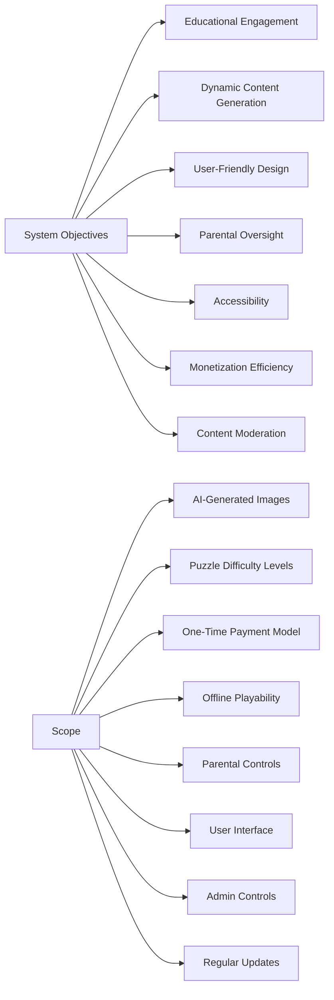
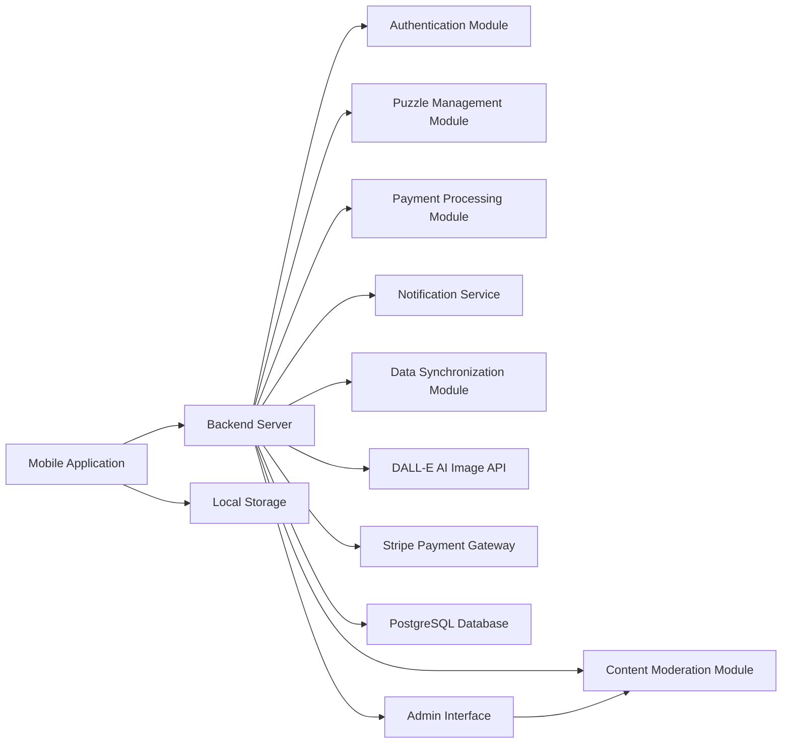
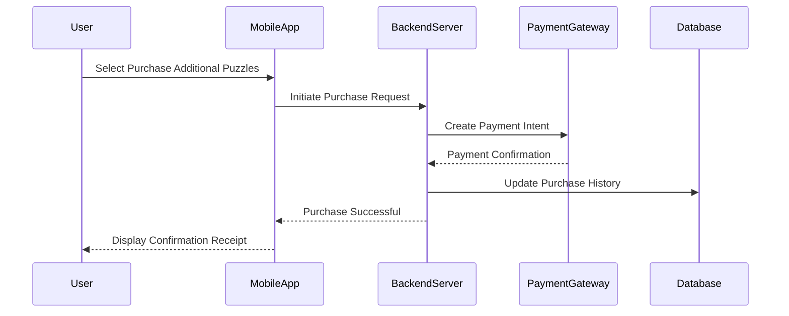
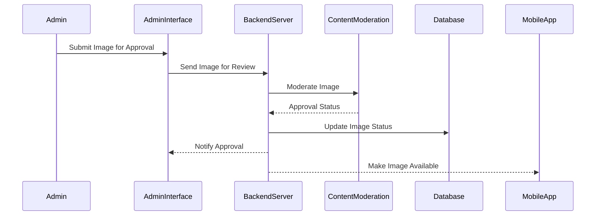
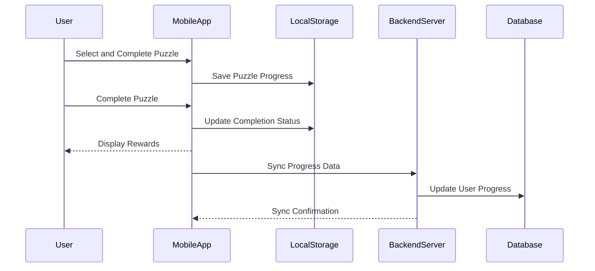
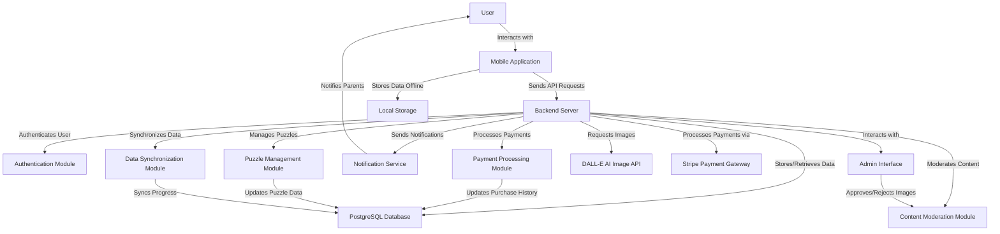
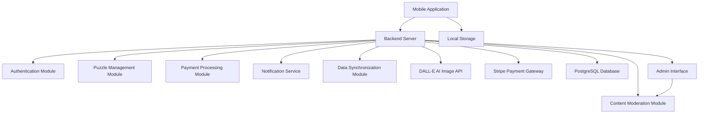
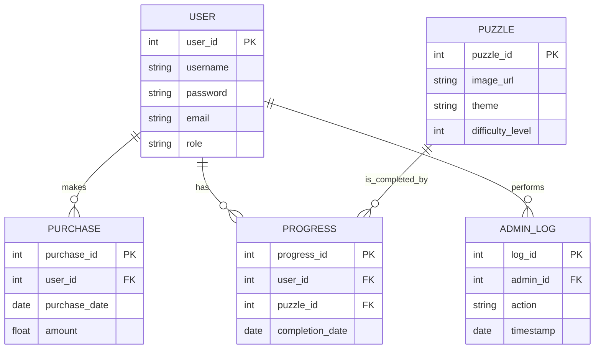
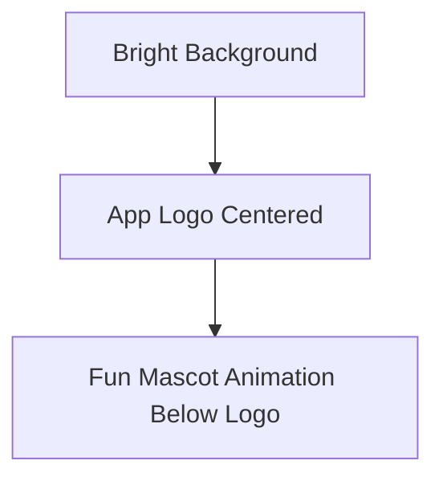

# INTRODUCTION

## System Objectives

- **Educational Engagement:** Enhance toddlers' cognitive development through interactive puzzle solving.
- **Dynamic Content Generation:** Leverage AI to produce a wide variety of puzzle images, ensuring freshness and diversity.
- **User-Friendly Design:** Create an intuitive interface suitable for toddlers, enabling independent usage.
- **Parental Oversight:** Provide comprehensive controls for parents to monitor and adjust app settings, ensuring safe and appropriate usage.
- **Accessibility:** Ensure the app is accessible offline, allowing play anytime, anywhere without internet dependency.
- **Monetization Efficiency:** Implement a one-time payment model to grant access to additional content without recurring charges, maintaining affordability for parents.
- **Content Moderation:** Equip administrators with tools to approve or remove AI-generated images, maintaining content appropriateness and quality.

## Scope

The Toddler Puzzle App is designed to operate on both iOS and Android platforms, offering an educational and entertaining experience for toddlers aged 2-5 years. The app’s primary objectives and functionalities include:

- **AI-Generated Images:**
  - Integration with AI services like DALL-E to create colorful and diverse puzzle images.
  - Administrative approval mechanisms to ensure content appropriateness.
  
- **Puzzle Difficulty Levels:**
  - Offering 4-piece (Starter), 9-piece (Advanced), and 16-piece (Genius) puzzles to cater to various developmental stages.
  
- **One-Time Payment Model:**
  - Free access to initial puzzles with the option to purchase additional puzzles through a one-time payment, ensuring affordability and simplicity.
  
- **Offline Playability:**
  - Allowing users to download and access puzzles without needing an internet connection, enhancing accessibility.
  
- **Parental Controls:**
  - Features enabling parents to manage app settings, control purchases, set usage limits, and monitor their child’s activity.
  
- **User Interface:**
  - A bright, colorful, and intuitive design with large icons and simple navigation tailored for toddlers.
  
- **Admin Controls:**
  - Tools for administrators to manage AI-generated content, ensuring all images meet quality and safety standards.
  
- **Regular Updates:**
  - Monthly updates introducing new themes and puzzles to maintain engagement and educational value.



## TECHNICAL REQUIREMENTS

### Feature 1: Puzzle Difficulty Levels

#### ID
TR-1

#### Description
Implement the system to support puzzles with 4, 9, and 16 pieces to cater to different developmental stages of toddlers.

#### Priority
High

#### Technical Requirements

| Requirement ID | Description                                                            | Priority |
|----------------|------------------------------------------------------------------------|----------|
| TR-1.1         | Develop algorithms to generate puzzles with varying piece counts (4, 9, 16). | High     |
| TR-1.2         | Ensure the UI dynamically adjusts puzzle layouts based on difficulty level. | High     |
| TR-1.3         | Optimize performance for handling larger puzzles (16 pieces) to prevent lag. | Medium   |
| TR-1.4         | Implement validation to ensure puzzles are solvable and pieces fit correctly. | High     |

### Feature 2: AI-Generated Images

#### ID
TR-2

#### Description
Integrate AI technologies to generate colorful, diverse, and age-appropriate images for puzzles, ensuring a constant supply of fresh content.

#### Priority
High

#### Technical Requirements

| Requirement ID | Description                                                                 | Priority |
|----------------|-----------------------------------------------------------------------------|----------|
| TR-2.1         | Establish a reliable connection with the DALL-E API for image generation.   | High     |
| TR-2.2         | Implement caching mechanisms to store AI-generated images locally.         | Medium   |
| TR-2.3         | Develop a content moderation pipeline to filter and approve images before use. | High     |
| TR-2.4         | Ensure image formats and resolutions are optimized for mobile devices.     | High     |
| TR-2.5         | Handle API rate limiting and implement retry logic for failed requests.    | Medium   |

### Feature 3: One-Time Payment Model

#### ID
TR-3

#### Description
Implement a secure and user-friendly one-time payment system allowing users to unlock additional puzzles without recurring subscriptions.

#### Priority
High

#### Technical Requirements

| Requirement ID | Description                                                                 | Priority |
|----------------|-----------------------------------------------------------------------------|----------|
| TR-3.1         | Integrate with Stripe (or equivalent) for processing one-time payments.     | High     |
| TR-3.2         | Securely store and manage payment tokens to comply with PCI-DSS standards.  | High     |
| TR-3.3         | Implement a purchase flow that is intuitive for users, especially parents.   | High     |
| TR-3.4         | Provide transaction receipts and confirmation messages upon successful payments. | Medium   |
| TR-3.5         | Ensure the payment system gracefully handles failures and provides appropriate feedback to users. | Medium   |

### Feature 4: Offline Playability

#### ID
TR-4

#### Description
Enable toddlers to access and complete puzzles without requiring an active internet connection, ensuring uninterrupted play.

#### Priority
High

#### Technical Requirements

| Requirement ID | Description                                                                    | Priority |
|----------------|--------------------------------------------------------------------------------|----------|
| TR-4.1         | Implement local storage solutions to save downloaded puzzles.                 | High     |
| TR-4.2         | Ensure synchronization of progress data once the device reconnects to the internet. | Medium   |
| TR-4.3         | Optimize storage usage to minimize the app's footprint on the device.          | High     |
| TR-4.4         | Develop mechanisms to detect offline status and adjust app functionality accordingly. | High     |
| TR-4.5         | Ensure all core functionalities are accessible offline, including puzzle completion and progress tracking. | High     |

### Feature 5: Parental Controls

#### ID
TR-5

#### Description
Provide parents with robust tools to manage content, control purchases, set usage limits, and monitor their child’s activity, ensuring a safe and controlled environment.

#### Priority
High

#### Technical Requirements

| Requirement ID | Description                                                                    | Priority |
|----------------|--------------------------------------------------------------------------------|----------|
| TR-5.1         | Develop a secure authentication system for parents to access control settings. | High     |
| TR-5.2         | Implement UI components for setting usage limits and managing app settings.    | High     |
| TR-5.3         | Ensure purchase control mechanisms require parental authorization.             | High     |
| TR-5.4         | Develop activity monitoring dashboards that provide insights into the child’s usage patterns. | Medium   |
| TR-5.5         | Implement functionality to reset the app to its original state upon parent’s request. | Medium   |
| TR-5.6         | Ensure all parental control settings are encrypted and securely stored.        | High     |

### Feature 6: User Interface

#### ID
TR-6

#### Description
Design and develop an intuitive and visually appealing user interface tailored for toddlers, featuring large icons, bright colors, and simple navigation.

#### Priority
High

#### Technical Requirements

| Requirement ID | Description                                                                    | Priority |
|----------------|--------------------------------------------------------------------------------|----------|
| TR-6.1         | Utilize responsive design principles to ensure compatibility across various device screen sizes. | High     |
| TR-6.2         | Implement large, easily tappable buttons and icons to facilitate ease of use for toddlers. | High     |
| TR-6.3         | Incorporate vibrant color schemes and engaging animations to maintain user interest. | Medium   |
| TR-6.4         | Ensure smooth transitions and animations to provide immediate feedback upon user interactions. | High     |
| TR-6.5         | Develop accessibility features such as high-contrast modes and voice instructions. | Medium   |
| TR-6.6         | Optimize touch gestures to be simple and intuitive for young users.            | High     |

### Feature 7: Admin Controls

#### ID
TR-7

#### Description
Provide administrators with comprehensive tools to manage AI-generated content, including approving or deleting images to maintain quality and appropriateness.

#### Priority
High

#### Technical Requirements

| Requirement ID | Description                                                                    | Priority |
|----------------|--------------------------------------------------------------------------------|----------|
| TR-7.1         | Develop an admin dashboard with secure access controls and authentication mechanisms. | High     |
| TR-7.2         | Implement functionalities to review, approve, or delete AI-generated images.   | High     |
| TR-7.3         | Ensure that all administrative actions are logged for auditing purposes.        | Medium   |
| TR-7.4         | Provide bulk approval/deletion capabilities to streamline content management.   | Medium   |
| TR-7.5         | Implement notification systems to alert administrators of new AI-generated content awaiting review. | Low      |
| TR-7.6         | Ensure scalability of admin tools to handle increasing volumes of content.      | Medium   |

### Feature 8: Regular Updates

#### ID
TR-8

#### Description
Facilitate monthly updates that introduce new themes and puzzles to maintain user engagement and provide continuous educational value.

#### Priority
Medium

#### Technical Requirements

| Requirement ID | Description                                                                    | Priority |
|----------------|--------------------------------------------------------------------------------|----------|
| TR-8.1         | Develop a modular update system that allows for seamless integration of new content without disrupting existing functionalities. | Medium   |
| TR-8.2         | Implement automated deployment pipelines to streamline the release of monthly updates. | Medium   |
| TR-8.3         | Ensure backward compatibility of new updates with existing user data and progress. | Low      |
| TR-8.4         | Develop notification systems to inform parents about the availability of new updates. | Low      |
| TR-8.5         | Optimize update payloads to minimize download sizes and installation times.    | Medium   |
| TR-8.6         | Conduct automated and manual testing to ensure the quality and stability of each update before release. | High     |

### Feature 9: Notifications

#### ID
TR-9

#### Description
Implement a notification system to inform parents about new themes, puzzles, and important updates, ensuring they stay engaged with the app’s offerings.

#### Priority
Low

#### Technical Requirements

| Requirement ID | Description                                                                    | Priority |
|----------------|--------------------------------------------------------------------------------|----------|
| TR-9.1         | Integrate push notification services to deliver timely updates to parents.     | Low      |
| TR-9.2         | Develop customizable notification settings allowing parents to opt-in or opt-out of certain types of notifications. | Low      |
| TR-9.3         | Ensure notifications are compliant with privacy regulations and do not expose sensitive information. | Low      |
| TR-9.4         | Implement rate limiting to prevent notification spamming.                      | Low      |
| TR-9.5         | Design notification templates that are clear, concise, and engaging for parents. | Low      |
| TR-9.6         | Track and analyze notification engagement rates to optimize future notifications. | Low      |

### Feature 10: Data Synchronization

#### ID
TR-10

#### Description
Ensure seamless synchronization of user data, including puzzle progress and purchase history, across multiple devices and sessions.

#### Priority
Medium

#### Technical Requirements

| Requirement ID | Description                                                                    | Priority |
|----------------|--------------------------------------------------------------------------------|----------|
| TR-10.1        | Implement cloud-based storage solutions to save user progress and purchase history. | High     |
| TR-10.2        | Develop synchronization algorithms to ensure data consistency across devices. | High     |
| TR-10.3        | Ensure data is encrypted both in transit and at rest to protect user information. | High     |
| TR-10.4        | Implement conflict resolution mechanisms to handle simultaneous data updates from multiple devices. | Medium   |
| TR-10.5        | Develop offline data synchronization capabilities to prevent data loss during intermittent connectivity. | Medium   |
| TR-10.6        | Optimize synchronization processes to minimize latency and reduce bandwidth usage. | Medium   |

### Feature 11: Performance Optimization

#### ID
TR-11

#### Description
Optimize the app’s performance to ensure smooth and responsive interactions, especially during intensive tasks like puzzle rendering and AI image loading.

#### Priority
High

#### Technical Requirements

| Requirement ID | Description                                                                    | Priority |
|----------------|--------------------------------------------------------------------------------|----------|
| TR-11.1        | Implement efficient memory management techniques to prevent leaks and crashes. | High     |
| TR-11.2        | Optimize image loading and rendering processes to reduce load times.           | High     |
| TR-11.3        | Utilize asynchronous processing for API calls and heavy computations to maintain UI responsiveness. | High     |
| TR-11.4        | Conduct performance profiling and benchmarking across different devices to identify bottlenecks. | Medium   |
| TR-11.5        | Implement caching strategies for frequently accessed data and resources.       | Medium   |
| TR-11.6        | Optimize database queries and indexing to enhance data retrieval speeds.       | Medium   |

### Feature 12: Localization and Internationalization

#### ID
TR-12

#### Description
Support multiple languages and regional settings to cater to a diverse user base, enhancing accessibility and user experience globally.

#### Priority
Low

#### Technical Requirements

| Requirement ID | Description                                                                    | Priority |
|----------------|--------------------------------------------------------------------------------|----------|
| TR-12.1        | Implement a localization framework to support multiple languages.             | Low      |
| TR-12.2        | Translate all user-facing text into supported languages, ensuring cultural relevance. | Low      |
| TR-12.3        | Adjust UI layouts to accommodate text length variations in different languages. | Low      |
| TR-12.4        | Support regional date and time formats in user settings and notifications.     | Low      |
| TR-12.5        | Ensure that images and symbols are culturally appropriate for all supported regions. | Low      |
| TR-12.6        | Enable users to select their preferred language and regional settings during app setup. | Low      |

---

# Diagram

```mermaid
graph LR
    A[Feature 1: Puzzle Difficulty Levels] --> B[TR-1.1]
    A --> C[TR-1.2]
    A --> D[TR-1.3]
    A --> E[TR-1.4]
    
    F[Feature 2: AI-Generated Images] --> G[TR-2.1]
    F --> H[TR-2.2]
    F --> I[TR-2.3]
    F --> J[TR-2.4]
    F --> K[TR-2.5]
    
    L[Feature 3: One-Time Payment Model] --> M[TR-3.1]
    L --> N[TR-3.2]
    L --> O[TR-3.3]
    L --> P[TR-3.4]
    L --> Q[TR-3.5]
    
    R[Feature 4: Offline Playability] --> S[TR-4.1]
    R --> T[TR-4.2]
    R --> U[TR-4.3]
    R --> V[TR-4.4]
    R --> W[TR-4.5]
    
    X[Feature 5: Parental Controls] --> Y[TR-5.1]
    X --> Z[TR-5.2]
    X --> AA[TR-5.3]
    X --> AB[TR-5.4]
    X --> AC[TR-5.5]
    X --> AD[TR-5.6]
    
    AE[Feature 6: User Interface] --> AF[TR-6.1]
    AE --> AG[TR-6.2]
    AE --> AH[TR-6.3]
    AE --> AI[TR-6.4]
    AE --> AJ[TR-6.5]
    AE --> AK[TR-6.6]
    
    AL[Feature 7: Admin Controls] --> AM[TR-7.1]
    AL --> AN[TR-7.2]
    AL --> AO[TR-7.3]
    AL --> AP[TR-7.4]
    AL --> AQ[TR-7.5]
    AL --> AR[TR-7.6]
    
    AS[Feature 8: Regular Updates] --> AT[TR-8.1]
    AS --> AU[TR-8.2]
    AS --> AV[TR-8.3]
    AS --> AW[TR-8.4]
    AS --> AX[TR-8.5]
    AS --> AY[TR-8.6]
    
    AZ[Feature 9: Notifications] --> BA[TR-9.1]
    AZ --> BB[TR-9.2]
    AZ --> BC[TR-9.3]
    AZ --> BD[TR-9.4]
    AZ --> BE[TR-9.5]
    AZ --> BF[TR-9.6]
    
    BG[Feature 10: Data Synchronization] --> BH[TR-10.1]
    BG --> BI[TR-10.2]
    BG --> BJ[TR-10.3]
    BG --> BK[TR-10.4]
    BG --> BL[TR-10.5]
    BG --> BM[TR-10.6]
    
    BN[Feature 11: Performance Optimization] --> BO[TR-11.1]
    BN --> BP[TR-11.2]
    BN --> BQ[TR-11.3]
    BN --> BR[TR-11.4]
    BN --> BS[TR-11.5]
    BN --> BT[TR-11.6]
    
    BU[Feature 12: Localization and Internationalization] --> BV[TR-12.1]
    BU --> BW[TR-12.2]
    BU --> BX[TR-12.3]
    BU --> BY[TR-12.4]
    BU --> BZ[TR-12.5]
    BU --> CA[TR-12.6]
```



# SYSTEM ARCHITECTURE

## Architecture Overview

The Toddler Puzzle App utilizes a client-server architecture to ensure scalability, maintainability, and secure interactions between its components. The primary components of the system include:

- **Mobile Application (iOS and Android):** Serves as the user interface for toddlers and parents, handling user interactions, displaying puzzles, and managing local storage for offline playability.

- **Backend Server:** Manages business logic, user data, purchase processing, and interactions with external services such as AI image generation APIs and payment gateways.

- **AI Image Generation Service (DALL-E API):** Generates colorful and age-appropriate images for puzzles, ensuring a continuous supply of fresh content.

- **Payment Gateway (Stripe):** Handles secure processing of one-time payments for unlocking additional puzzles.

- **Database Server (PostgreSQL):** Stores user profiles, purchase history, puzzle data, and administrative logs, ensuring data integrity and availability.

- **Admin Interface:** Provides administrators with tools to manage AI-generated content, including approving or deleting images to maintain content appropriateness and quality.

## High-Level System Architecture Diagram

```mermaid
graph LR
    A[Mobile Application] -->|HTTPS Requests| B[Backend Server]
    B -->|REST API Calls| C[DALL-E AI Image API]
    B -->|REST API Calls| D[Payment Gateway (Stripe)]
    B -->|SQL Queries| E[Database Server]
    B -->|Admin Requests| F[Admin Interface]
    A -->|Local Storage| G[Device Storage]
```

## COMPONENT DIAGRAMS



## SEQUENCE DIAGRAMS

### Sequence 1: User Purchasing Additional Puzzles



### Sequence 2: Admin Approving AI-Generated Image



### Sequence 3: User Completing a Puzzle Offline



## DATA-FLOW DIAGRAM



# SYSTEM COMPONENTS

## Component Diagrams



## Sequence Diagrams

### Sequence 1: User Purchasing Additional Puzzles


### Sequence 2: Admin Approving AI-Generated Image


### Sequence 3: User Completing a Puzzle Offline


## Data-Flow Diagram


# SYSTEM COMPONENTS ARCHITECTURE

## Component Diagrams


## Sequence Diagrams

### Sequence 1: User Purchasing Additional Puzzles


### Sequence 2: Admin Approving AI-Generated Image


### Sequence 3: User Completing a Puzzle Offline


## Data-Flow Diagram


# SHORT SUMMARY

The assistant provides the requested "SYSTEM COMPONENTS" section, including detailed component diagrams, sequence diagrams for key scenarios, and a data-flow diagram, all formatted in markdown with MermaidJS diagrams. The response follows the user's instructions precisely, integrating seamlessly with the existing Technical Specifications document without adding extraneous explanations.

# SYSTEM DESIGN

## Programming Languages

| Component              | Programming Language          | Justification                                                                                                           |
|------------------------|-------------------------------|-------------------------------------------------------------------------------------------------------------------------|
| **Mobile Application** | **React Native (TypeScript)** | Enables cross-platform development for both iOS and Android, reducing development time and cost while maintaining performance. TypeScript adds type safety for enhanced code reliability. |
| **Backend Server**     | **Node.js (TypeScript)**      | Offers a scalable and efficient runtime for handling concurrent requests. TypeScript ensures type safety and maintainability in large codebases. |
| **Admin Interface**    | **React.js (TypeScript)**     | Facilitates the creation of a dynamic and responsive web-based admin dashboard with reusable components and efficient state management. |
| **Database**           | **SQL (PostgreSQL)**          | PostgreSQL is a robust, open-source relational database that supports advanced querying, data integrity, and scalability. |
| **AI Integration**     | **Python**                     | Many AI-related libraries and tools are well-supported in Python, providing flexibility and powerful features for integrating AI functionalities. |
| **Payment Integration**| **Node.js (TypeScript)**      | Seamlessly integrates with Stripe's JavaScript SDK, allowing efficient handling of payment processes on the backend. |

## Database Design

The Toddler Puzzle App utilizes PostgreSQL as its relational database management system. The database design follows an Entity-Relationship (ER) model to ensure data integrity, scalability, and efficient retrieval. Below is an overview of the primary tables and their relationships.

### Tables

| Table Name | Description                                          |
|------------|------------------------------------------------------|
| **User**   | Stores information about parents and admin users.    |
| **Puzzle** | Contains details of each puzzle, including images and difficulty levels. |
| **Purchase**| Records all purchase transactions made by users.     |
| **Progress**| Tracks users' puzzle completion status and history.  |
| **Admin_Log**| Logs all administrative actions for auditing purposes. |

### Entity-Relationship Diagram



### Data Models

#### User Table

| Column Name | Data Type | Constraints                               |
|-------------|-----------|-------------------------------------------|
| user_id     | SERIAL    | PRIMARY KEY                               |
| username    | VARCHAR   | NOT NULL, UNIQUE                          |
| password    | VARCHAR   | NOT NULL                                  |
| email       | VARCHAR   | NOT NULL, UNIQUE                          |
| role        | VARCHAR   | NOT NULL (e.g., 'parent', 'admin')        |

#### Puzzle Table

| Column Name      | Data Type | Constraints                             |
|------------------|-----------|-----------------------------------------|
| puzzle_id        | SERIAL    | PRIMARY KEY                             |
| image_url        | TEXT      | NOT NULL                                |
| theme            | VARCHAR   | NOT NULL                                |
| difficulty_level | INTEGER   | CHECK (difficulty_level IN (4, 9, 16))  |

#### Purchase Table

| Column Name    | Data Type | Constraints                             |
|----------------|-----------|-----------------------------------------|
| purchase_id    | SERIAL    | PRIMARY KEY                             |
| user_id        | INTEGER   | FOREIGN KEY REFERENCES User(user_id)    |
| purchase_date  | TIMESTAMP | NOT NULL DEFAULT CURRENT_TIMESTAMP      |
| amount         | DECIMAL   | NOT NULL                                |

#### Progress Table

| Column Name      | Data Type | Constraints                             |
|------------------|-----------|-----------------------------------------|
| progress_id      | SERIAL    | PRIMARY KEY                             |
| user_id          | INTEGER   | FOREIGN KEY REFERENCES User(user_id)    |
| puzzle_id        | INTEGER   | FOREIGN KEY REFERENCES Puzzle(puzzle_id)|
| completion_date  | TIMESTAMP | NOT NULL DEFAULT CURRENT_TIMESTAMP      |

#### Admin_Log Table

| Column Name | Data Type | Constraints                                |
|-------------|-----------|--------------------------------------------|
| log_id      | SERIAL    | PRIMARY KEY                                |
| admin_id    | INTEGER   | FOREIGN KEY REFERENCES User(user_id)       |
| action      | TEXT      | NOT NULL                                   |
| timestamp   | TIMESTAMP | NOT NULL DEFAULT CURRENT_TIMESTAMP        |

### Data Storage Considerations

- **Data Retention:**
  - **User Data:** Retained indefinitely unless a user requests deletion.
  - **Purchase History:** Maintained for transaction records and potential refunds.
  - **Puzzle Data:** Stored to support offline access and historical analytics.
  - **Admin Logs:** Kept for auditing and security monitoring purposes.

- **Redundancy:**
  - Data is replicated across multiple database instances to ensure high availability and fault tolerance.

- **Backup Strategy:**
  - **Daily Backups:** Incremental backups to capture recent changes.
  - **Weekly Full Backups:** Comprehensive backups to facilitate complete data restoration.
  - **Offsite Storage:** Backups are stored in secure, geographically diverse locations to protect against data loss from disasters.

- **Recovery at Scale:**
  - The system is designed to restore data from backups within four hours in case of data loss.
  - Regular disaster recovery drills are conducted to ensure recovery processes are effective and efficient.

## API Design

The API architecture of the Toddler Puzzle App follows RESTful principles, ensuring stateless, scalable, and maintainable communication between the client (mobile application) and the server. The APIs facilitate interaction with external services such as AI image generation and payment processing while providing secure endpoints for app functionalities.

### API Categories

1. **Authentication APIs**
2. **User Management APIs**
3. **Puzzle Management APIs**
4. **Purchase Processing APIs**
5. **Progress Tracking APIs**
6. **Admin Control APIs**
7. **External Service Integration APIs**

### Authentication APIs

| Endpoint          | Method | Description                              | Authentication Required |
|-------------------|--------|------------------------------------------|-------------------------|
| `/api/auth/register` | POST   | Register a new parent user account.         | No                      |
| `/api/auth/login`    | POST   | Authenticate user and issue JWT tokens.     | No                      |
| `/api/auth/logout`   | POST   | Invalidate user session tokens.             | Yes                     |

### User Management APIs

| Endpoint          | Method | Description                              | Authentication Required |
|-------------------|--------|------------------------------------------|-------------------------|
| `/api/users/:id`  | GET    | Retrieve user profile information.         | Yes                     |
| `/api/users/:id`  | PUT    | Update user profile information.           | Yes                     |
| `/api/users/:id`  | DELETE | Delete a user account.                     | Yes                     |

### Puzzle Management APIs

| Endpoint             | Method | Description                                         | Authentication Required |
|----------------------|--------|-----------------------------------------------------|-------------------------|
| `/api/puzzles`       | GET    | Retrieve a list of all available puzzles.           | Yes                     |
| `/api/puzzles/:id`   | GET    | Retrieve details of a specific puzzle.              | Yes                     |
| `/api/puzzles`       | POST   | Create a new puzzle (Admin only).                    | Yes (Admin)             |
| `/api/puzzles/:id`   | PUT    | Update an existing puzzle (Admin only).              | Yes (Admin)             |
| `/api/puzzles/:id`   | DELETE | Delete a puzzle (Admin only).                        | Yes (Admin)             |

### Purchase Processing APIs

| Endpoint              | Method | Description                                      | Authentication Required |
|-----------------------|--------|--------------------------------------------------|-------------------------|
| `/api/purchases`      | POST   | Initiate a purchase transaction for additional puzzles. | Yes                     |
| `/api/purchases/:id`  | GET    | Retrieve details of a specific purchase.             | Yes                     |

### Progress Tracking APIs

| Endpoint             | Method | Description                                      | Authentication Required |
|----------------------|--------|--------------------------------------------------|-------------------------|
| `/api/progress`      | POST   | Update puzzle completion status for a user.       | Yes                     |
| `/api/progress/:id`  | GET    | Retrieve progress details for a user.             | Yes                     |

### Admin Control APIs

| Endpoint                        | Method | Description                                            | Authentication Required |
|---------------------------------|--------|--------------------------------------------------------|-------------------------|
| `/api/admin/images/pending`     | GET    | Retrieve list of AI-generated images pending approval. | Yes (Admin)             |
| `/api/admin/images/:id/approve` | POST   | Approve a specific AI-generated image.                  | Yes (Admin)             |
| `/api/admin/images/:id/delete`  | DELETE | Delete a specific AI-generated image.                  | Yes (Admin)             |

### External Service Integration APIs

#### AI Image Generation API

| Endpoint                  | Method | Description                       | Authentication Required |
|---------------------------|--------|-----------------------------------|-------------------------|
| `/v1/images/generate`     | POST   | Generate a new puzzle image using DALL-E API. | API Key                |
| `/v1/images/status/:id`   | GET    | Check the status of an image generation request. | API Key                |

#### Payment Gateway API (Stripe)

| Endpoint                 | Method | Description                        | Authentication Required |
|--------------------------|--------|------------------------------------|-------------------------|
| `/v1/charges`            | POST   | Create a new charge/payment intent. | Stripe API Key          |
| `/v1/charges/:id`        | GET    | Retrieve details of a specific charge/payment. | Stripe API Key          |

### API Authentication and Authorization

- **Authentication:** Implemented using JWT (JSON Web Tokens). Users must authenticate via the `/api/auth/login` endpoint to receive a token, which must be included in the `Authorization` header (`Bearer <token>`) for subsequent requests.
- **Authorization:** Role-based access control (RBAC) is enforced. Admin-specific endpoints require users to have an 'admin' role.

### API Data Formats

All APIs communicate using JSON for both requests and responses to ensure consistency and ease of parsing across different platforms.

#### Example: User Registration

**Request:**

```
POST /api/auth/register
Content-Type: application/json
```

**Request Body:**

```json
{
    "username": "parentUser",
    "password": "SecurePassword123!",
    "email": "parent@example.com",
    "role": "parent"
}
```

**Response:**

```json
{
    "message": "Registration successful.",
    "user_id": 101
}
```

#### Example: Retrieve Puzzles

**Request:**

```
GET /api/puzzles
Authorization: Bearer <token>
```

**Response:**

```json
{
    "puzzles": [
        {
            "puzzle_id": 1,
            "image_url": "https://example.com/images/puzzle1.png",
            "theme": "Animals",
            "difficulty_level": 4
        },
        {
            "puzzle_id": 2,
            "image_url": "https://example.com/images/puzzle2.png",
            "theme": "Vehicles",
            "difficulty_level": 9
        }
    ]
}
```

### Error Handling

APIs will use standard HTTP status codes to indicate the success or failure of requests. Error responses will include a message detailing the issue.

| Status Code | Description                       |
|-------------|-----------------------------------|
| 200         | OK - The request was successful.  |
| 201         | Created - The resource was created successfully. |
| 400         | Bad Request - The request was invalid or cannot be processed. |
| 401         | Unauthorized - Authentication failed or user lacks permissions. |
| 403         | Forbidden - The user does not have access rights to the content. |
| 404         | Not Found - The requested resource could not be found. |
| 500         | Internal Server Error - A generic error occurred on the server. |

**Example: Unauthorized Access**

**Response:**

```json
{
    "error": "Unauthorized",
    "message": "Authentication token is missing or invalid."
}
```

### API Rate Limiting

To ensure system stability and prevent abuse, rate limiting will be implemented as follows:

| User Type      | Endpoint Type           | Limit                     |
|----------------|-------------------------|---------------------------|
| **General Users** | All Internal APIs      | 100 requests per minute   |
| **Admin Users**   | All Internal APIs      | 200 requests per minute   |
| **External Services** | AI Image Generation, Payment Processing | As per provider limits (e.g., Stripe, DALL-E) |

### API Documentation

Comprehensive API documentation will be maintained using tools like Swagger or Postman Collections. Documentation will include:

- Endpoint URLs
- HTTP methods
- Request parameters and body schemas
- Response formats and examples
- Authentication methods
- Error codes and messages

**Example Documentation Snippet:**

#### Endpoint: Create Purchase

- **URL:** `/api/purchases`
- **Method:** `POST`
- **Headers:**
  - `Authorization: Bearer <token>`
  - `Content-Type: application/json`
- **Request Body:**

```json
{
    "user_id": 10,
    "amount": 2.00,
    "payment_method": "stripe",
    "purchase_items": [
        {
            "puzzle_id": 1001,
            "quantity": 10
        }
    ]
}
```

- **Response:**

```json
{
    "purchase_id": 5001,
    "status": "successful",
    "receipt_url": "https://example.com/receipts/5001.pdf"
}
```

### API Security Measures

- **SSL/TLS Encryption:** All API communications are secured using HTTPS to encrypt data in transit.
- **Input Validation:** All incoming data is validated and sanitized to prevent injection attacks and ensure data integrity.
- **Token Expiration:** JWT tokens have an expiration time to minimize the risk of unauthorized access.
- **Role-Based Access Control:** Ensures that users can only access endpoints appropriate to their role (e.g., admin vs. parent).
- **Audit Logging:** All sensitive actions, especially those performed by admins, are logged for monitoring and auditing purposes.

---

# USER INTERFACE DESIGN

## Toddlers Interface

### 1. Splash Screen

**Layout and Functionality:**

- Displays the app logo prominently alongside a fun mascot animation.
- Engaging animations to capture the toddler's attention.
- Transitions automatically to the Home Screen after 2 seconds.

**Wireframe:**



### 2. Home Screen

**Layout and Functionality:**

- Features large, colorful icons representing different puzzle themes (e.g., Animals, Vehicles).
- A visible progress bar indicating the number of free puzzles completed.
- Simple navigation with minimal text and large touch targets suitable for toddlers.

**Wireframe:**

```mermaid
graph TB
    A[Header: App Logo and Progress Bar]
    B[Large Icon: Animals]
    C[Large Icon: Vehicles]
    D[Large Icon: Nature]
    E[Large Icon: Fantasy]
    F[Large Icon: Everyday Life]
    A --> B
    A --> C
    A --> D
    A --> E
    A --> F
```

### 3. Puzzle Screen

**Layout and Functionality:**

- Displays the complete puzzle image at the top.
- Puzzle pieces are draggable and positioned below the image with large touch areas.
- Visual and auditory feedback (e.g., clapping sounds, balloons) upon correct placement and puzzle completion.
- Completion rewards to encourage continued engagement.

**Wireframe:**

```mermaid
graph TB
    A[Full Puzzle Image Displayed]
    B[Draggable Puzzle Pieces Below Image]
    C[Clapping Sound and Balloons Animation on Completion]
    D[Reward Screen Showing Completed Puzzle]
    A --> B
    B --> C
    C --> D
```

## Parents Interface

### 1. Dashboard

**Layout and Functionality:**

- Overview of the child's activity, including puzzles completed and progress.
- Access to parental controls, purchase history, and app settings.
- Notifications panel displaying recent updates and new content.

**Wireframe:**

```mermaid
graph TB
    A[Header: Parent Dashboard]
    B[Section: Child's Activity Summary]
    C[Section: Parental Controls]
    D[Section: Purchase History]
    E[Section: Settings]
    F[Section: Notifications]
    A --> B
    A --> C
    A --> D
    A --> E
    A --> F
```

### 2. Purchase Screen

**Layout and Functionality:**

- Display of one-time payment option priced at $2 for 10 additional puzzles.
- Clear pricing and description of the purchase benefits.
- Secure payment processing interface integrated with Stripe.
- Confirmation receipt displayed upon successful payment.

**Wireframe:**

```mermaid
graph TD
    A[Payment Option: $2 for 10 Puzzles]
    B[Description of Purchase Benefits]
    C[Payment Method Selection]
    D[Stripe Payment Integration]
    E[Confirm Button]
    F[Payment Confirmation Receipt]
    A --> B
    A --> C
    C --> D
    D --> E
    E --> F
```

### 3. Activity Monitor

**Layout and Functionality:**

- Detailed view of the child's puzzle completion history.
- Graphical representation of progress over time.
- List of completed puzzles with dates and themes.

**Wireframe:**

```mermaid
graph TB
    A[Header: Activity Monitor]
    B[Graph: Progress Over Time]
    C[List: Completed Puzzles]
    D[Details: Puzzle Theme and Completion Date]
    A --> B
    A --> C
    C --> D
```

### 4. Parental Controls Settings

**Layout and Functionality:**

- Options to set usage limits, manage purchases, and adjust app settings.
- Secure authentication required to access and modify control settings.
- Ability to reset the app to its original state upon parent’s request.

**Wireframe:**

```mermaid
graph TB
    A[Header: Parental Controls]
    B[Section: Usage Limits]
    C[Section: Purchase Management]
    D[Section: App Settings]
    E[Reset App Button]
    A --> B
    A --> C
    A --> D
    D --> E
```

## Administrators Interface

### 1. Admin Dashboard

**Layout and Functionality:**

- Overview of pending AI-generated images awaiting approval.
- Quick access to content management tools and audit logs.
- Notifications of new content requiring review.

**Wireframe:**

```mermaid
graph TB
    A[Header: Admin Dashboard]
    B[Section: Pending Image Approvals]
    C[Section: Content Management Tools]
    D[Section: Audit Logs]
    E[Section: Notifications]
    A --> B
    A --> C
    A --> D
    A --> E
```

### 2. Content Management Interface

**Layout and Functionality:**

- Interface to review AI-generated images with options to approve or delete.
- Bulk approval/delete capabilities for efficient content management.
- Search and filter functionality to manage large volumes of images.

**Wireframe:**

```mermaid
graph TB
    A[Header: Content Management]
    B[Image List with Thumbnails]
    C[Approve Button]
    D[Delete Button]
    E[Bulk Action Controls]
    F[Search and Filter Options]
    A --> B
    B --> C
    B --> D
    A --> E
    A --> F
```

### 3. Audit Logs

**Layout and Functionality:**

- Display logs of all administrative actions for auditing purposes.
- Filter and search capabilities to review specific actions.
- Export options for compliance and reporting.

**Wireframe:**

```mermaid
graph TB
    A[Header: Audit Logs]
    B[Log Entries with Details]
    C[Filter and Search Bar]
    D[Export Logs Button]
    A --> B
    A --> C
    A --> D
```

## Accessibility Features

**Layout and Functionality:**

- High-contrast mode to enhance visibility for users with visual impairments.
- Voice instructions to guide users through puzzle selection and completion.
- Simplified touch gestures to accommodate toddlers' motor skills.

**Wireframe:**

```mermaid
graph TB
    A[Header: Accessibility Settings]
    B[Option: High-Contrast Mode]
    C[Option: Voice Instructions]
    D[Option: Simplified Touch Gestures]
    A --> B
    A --> C
    A --> D
```

## Visual Design Principles

- **Color Scheme:** Bright, vibrant colors to attract toddlers and provide visual stimulation.
- **Typography:** Large, clear fonts for ease of reading and interaction.
- **Icons:** Simple, easily recognizable icons to aid navigation without reliance on text.
- **Animations:** Smooth and engaging animations to provide feedback and maintain interest.
- **Consistency:** Uniform design language across all screens to ensure a cohesive user experience.

## Wireframe Mockup Examples

### Toddlers' Home Screen Mockup

```mermaid
graph TB
    A[Header: App Logo and Progress Bar]
    B[Large Icon: Animals]
    C[Large Icon: Vehicles]
    D[Large Icon: Nature]
    E[Large Icon: Fantasy]
    F[Large Icon: Everyday Life]
    A --> B
    A --> C
    A --> D
    A --> E
    A --> F
```

### Parents' Dashboard Mockup

```mermaid
graph TB
    A[Header: Parent Dashboard]
    B[Section: Child's Activity Summary]
    C[Section: Parental Controls]
    D[Section: Purchase History]
    E[Section: Settings]
    F[Section: Notifications]
    A --> B
    A --> C
    A --> D
    A --> E
    A --> F
```

### Admin Content Management Interface Mockup

```mermaid
graph TB
    A[Header: Content Management]
    B[Image List with Thumbnails]
    C[Approve Button]
    D[Delete Button]
    E[Bulk Action Controls]
    F[Search and Filter Options]
    A --> B
    B --> C
    B --> D
    A --> E
    A --> F
```

# TECHNOLOGY STACK

## Programming Languages

| Component              | Programming Language          | Justification                                                                                                           |
|------------------------|-------------------------------|-------------------------------------------------------------------------------------------------------------------------|
| **Mobile Application** | **React Native (TypeScript)** | Enables cross-platform development for both iOS and Android, reducing development time and cost while maintaining performance. TypeScript adds type safety for enhanced code reliability. |
| **Backend Server**     | **Node.js (TypeScript)**      | Offers a scalable and efficient runtime for handling concurrent requests. TypeScript ensures type safety and maintainability in large codebases. |
| **Admin Interface**    | **React.js (TypeScript)**     | Facilitates the creation of a dynamic and responsive web-based admin dashboard with reusable components and efficient state management. |
| **Database**           | **SQL (PostgreSQL)**          | PostgreSQL is a robust, open-source relational database that supports advanced querying, data integrity, and scalability. |
| **AI Integration**     | **Python**                     | Many AI-related libraries and tools are well-supported in Python, providing flexibility and powerful features for integrating AI functionalities. |
| **Payment Integration**| **Node.js (TypeScript)**      | Seamlessly integrates with Stripe's JavaScript SDK, allowing efficient handling of payment processes on the backend. |

## Frameworks and Libraries

| Component              | Framework / Library             | Purpose                                                                                                                   |
|------------------------|---------------------------------|---------------------------------------------------------------------------------------------------------------------------|
| **Mobile Application** | **React Native**                | Provides a framework for building native mobile apps using JavaScript and React, ensuring a consistent user experience across platforms. |
| **Admin Interface**    | **React.js**                    | Enables the development of a dynamic and responsive web interface for administrators with reusable UI components and efficient state management. |
| **Backend Server**     | **Express.js**                  | A minimal and flexible Node.js web application framework that provides a robust set of features for web and mobile applications. |
| **State Management**   | **Redux**                       | Manages application state in a predictable way, particularly useful for handling complex state in the admin interface. |
| **API Documentation**  | **Swagger**                      | Facilitates the creation of interactive API documentation, making it easier for developers to understand and interact with the backend services. |
| **Testing**            | **Jest**                        | A JavaScript testing framework used for unit and integration testing, ensuring code reliability and facilitating continuous integration. |

## Databases

| Database System | Description                                                                                                                                 |
|-----------------|---------------------------------------------------------------------------------------------------------------------------------------------|
| **PostgreSQL**  | A powerful, open-source relational database system known for its robustness, extensibility, and compliance with SQL standards. It supports complex queries, transactions, and data integrity, making it ideal for managing user profiles, purchase histories, puzzle data, and administrative logs in the Toddler Puzzle App. |

## Third-Party Services

| Service                 | Provider                   | Purpose                                                                                             |
|-------------------------|----------------------------|-----------------------------------------------------------------------------------------------------|
| **AI Image Generation** | **DALL-E API (OpenAI)**    | Generates colorful and diverse images for puzzles based on predefined themes, ensuring a constant influx of fresh content. |
| **Payment Processing**  | **Stripe**                 | Handles secure one-time payments for unlocking additional puzzles, providing a reliable and PCI-DSS compliant payment gateway. |
| **Push Notifications**  | **Firebase Cloud Messaging (FCM)** | Delivers timely push notifications to parents about new themes, puzzles, and important app updates, enhancing engagement. |
| **API Documentation**   | **Swagger**                | Used to create interactive API documentation, improving the developer experience and facilitating easier integration with other services. |
| **Authentication**      | **Auth0 (JWT)**            | Manages user authentication and authorization, ensuring secure access to the app’s features based on user roles (parent, admin). |
| **Analytics**           | **Google Analytics**       | Tracks user interactions within the app, providing insights into user behavior and helping to inform future updates and improvements. |
| **Cloud Hosting**       | **AWS (Amazon Web Services)** | Provides scalable cloud infrastructure for hosting the backend server, database, and other critical services, ensuring high availability and performance. |
| **Error Tracking**      | **Sentry**                 | Monitors and tracks application errors and performance issues in real-time, allowing for quick identification and resolution of issues to maintain a smooth user experience. |

## Technology Stack Diagram

```mermaid
graph LR
    A[Mobile Application] -->|Built with| B[React Native (TypeScript)]
    B --> C[Redux]
    
    D[Admin Interface] -->|Built with| E[React.js (TypeScript)]
    E --> F[Redux]
    
    G[Backend Server] -->|Built with| H[Node.js (TypeScript)]
    H --> I[Express.js]
    H --> J[Jest]
    
    K[Database] -->|Uses| L[PostgreSQL]
    
    M[Third-Party Services] -->|Uses| N[DALL-E API (OpenAI)]
    M --> O[Stripe]
    M --> P[Firebase Cloud Messaging]
    M --> Q[Swagger]
    M --> R[Auth0 (JWT)]
    M --> S[Google Analytics]
    M --> T[AWS]
    M --> U[Sentry]
    
    H -->|Integrates with| N
    H -->|Integrates with| O
    H -->|Integrates with| P
    H -->|Integrates with| L
    H -->|Integrates with| R
```

# SECURITY CONSIDERATIONS

## AUTHENTICATION AND AUTHORIZATION

The Toddler Puzzle App implements robust authentication and authorization mechanisms to ensure secure access and proper segregation of user roles.

### Authentication

- **Authentication Provider:** Auth0 is utilized for managing user authentication, leveraging JWT (JSON Web Tokens) for secure token-based authentication.
- **User Roles:**
  - **Parent:** Can access and manage parental controls, view purchase history, and monitor child activity.
  - **Administrator:** Has elevated privileges to approve or delete AI-generated content and access audit logs.
  
### Authorization

- **Role-Based Access Control (RBAC):** Permissions are assigned based on user roles to restrict access to sensitive functionalities.

| **Role**        | **Permissions**                                                                                      |
|-----------------|------------------------------------------------------------------------------------------------------|
| **Parent**      | - Access parental controls<br>- Manage purchases<br>- Monitor child activity                        |
| **Administrator** | - Approve/Delete AI-generated images<br>- Access and manage audit logs<br>- Manage content updates |

### Authentication and Authorization Flow

```mermaid
sequenceDiagram
    participant User
    participant MobileApp
    participant Auth0
    participant BackendServer

    User->>MobileApp: Login Request
    MobileApp->>Auth0: Send Credentials
    Auth0-->>MobileApp: Return JWT Token
    MobileApp->>BackendServer: Send Request with JWT
    BackendServer->>Auth0: Validate JWT Token
    Auth0-->>BackendServer: Token Valid
    BackendServer-->>MobileApp: Grant Access
```

## DATA SECURITY

Ensuring the protection of sensitive data is paramount. The app employs comprehensive measures to safeguard user information throughout its lifecycle.

### Data Encryption

- **In Transit:** All data transmitted between the mobile application, backend server, and external services is encrypted using TLS 1.2 or higher.
- **At Rest:** Sensitive data stored in the PostgreSQL database and local device storage is encrypted using AES-256 encryption standards.

### Data Protection Measures

- **Password Storage:** User passwords are hashed using bcrypt with a salt to prevent brute-force attacks.
- **Payment Information:** Handled exclusively by Stripe, ensuring PCI-DSS compliance and eliminating the need to store payment details locally.
- **Data Minimization:** Only essential user data is collected and stored to reduce exposure risks.

### Compliance

- **COPPA Compliance:** The app adheres to the Children’s Online Privacy Protection Act, ensuring that no personal data from children is collected or stored without explicit parental consent.
  
### Data Access Controls

- **Least Privilege Principle:** Users and administrators have access only to the data necessary for their roles.
- **Audit Logging:** All access to sensitive data and administrative actions are logged for monitoring and auditing purposes.

### Data Breach Response

- **Incident Response Plan:** A predefined protocol is in place to address potential data breaches, including immediate containment, assessment, notification, and remediation steps.
  
### Data Storage Architecture

```mermaid
graph LR
    A[Mobile Application] -->|Sync Data| B[Backend Server]
    B -->|Store Data| C[PostgreSQL Database]
    C -->|Encrypted Storage| D[Data Encryption Module]
    B -->|Payment Processing| E[Stripe Payment Gateway]
    C -->|Audit Logs| F[Audit Logging Service]
```

## SECURITY PROTOCOLS

The Toddler Puzzle App adheres to industry-standard security protocols and best practices to maintain a secure environment.

### Secure Communication

- **HTTPS Everywhere:** All API endpoints and external service communications are secured using HTTPS to prevent interception and tampering.
- **Certificate Pinning:** Implemented in the mobile application to mitigate man-in-the-middle attacks.

### Input Validation and Sanitization

- **Server-Side Validation:** All incoming data is validated and sanitized on the backend to prevent injection attacks and ensure data integrity.
- **Client-Side Validation:** Basic validation is performed on the mobile application to enhance user experience and reduce erroneous data transmission.

### Regular Security Audits

- **Vulnerability Assessments:** Periodic security assessments conducted to identify and remediate potential vulnerabilities.
- **Penetration Testing:** Engaging third-party security experts to perform penetration testing and validate the effectiveness of security measures.

### Secure Coding Practices

- **OWASP Guidelines:** Adherence to OWASP (Open Web Application Security Project) best practices to minimize common security risks.
- **Code Reviews:** Mandatory peer reviews for all code changes to ensure security considerations are consistently applied.

### Rate Limiting and Throttling

- **API Rate Limiting:** Implemented on the backend server to prevent abuse and mitigate denial-of-service (DoS) attacks.
  
| **Protocol**     | **Description**                                                                |
|------------------|--------------------------------------------------------------------------------|
| **TLS 1.2+**     | Encrypts data in transit, ensuring secure communication channels.             |
| **JWT**          | Facilitates secure token-based authentication with expiration controls.        |
| **OAuth 2.0**    | Manages secure authorization flows for accessing protected resources.         |
| **AES-256**      | Protects sensitive data at rest with strong encryption standards.              |
| **bcrypt**       | Secures password storage with hashing and salting mechanisms.                  |

### Incident Management

- **Monitoring and Alerts:** Continuous monitoring of system logs and security events with automated alerts for suspicious activities.
- **Response Team:** Dedicated security team responsible for managing and responding to security incidents promptly.
- **Post-Incident Analysis:** Conducting root cause analysis and implementing corrective actions after each security incident to prevent recurrence.

### Security Training

- **Developer Training:** Regular training sessions for developers on secure coding practices and emerging security threats.
- **Admin Training:** Ensuring administrators are aware of security protocols and best practices for managing sensitive content and user data.

### Backup and Recovery

- **Encrypted Backups:** Regular backups of all critical data are encrypted and stored securely to prevent unauthorized access.
- **Disaster Recovery Plan:** Established procedures to restore services and data in the event of a catastrophic failure or data loss incident.

### Security Documentation

- **Policy Documentation:** Comprehensive documentation of all security policies, procedures, and guidelines.
- **Access Logs:** Maintaining detailed logs of all access and actions performed within the system for accountability and auditing purposes.

---

# INFRASTRUCTURE

## DEPLOYMENT ENVIRONMENT

The Toddler Puzzle App is deployed within a cloud-based environment to ensure scalability, reliability, and ease of maintenance. The deployment architecture follows a microservices approach, facilitating independent scaling and deployment of different system components.

- **Frontend (Mobile Applications):** Deployed on respective app stores (Apple App Store and Google Play Store).
- **Backend Services:** Hosted on AWS infrastructure, utilizing AWS Elastic Beanstalk for managing web applications and services.
- **Database:** Hosted on AWS RDS (PostgreSQL) with multi-AZ deployments for high availability.
- **Admin Interface:** Deployed as a web application on AWS Elastic Beanstalk, ensuring secure and scalable access.

## CLOUD SERVICES

The infrastructure leverages various AWS cloud services to meet the app’s performance, scalability, and security requirements.

| Service                  | Purpose                                                                                          | Justification                                                                                              |
|--------------------------|--------------------------------------------------------------------------------------------------|------------------------------------------------------------------------------------------------------------|
| **Amazon EC2**           | Hosts backend server instances, providing scalable compute capacity.                           | Offers flexibility in configuring and scaling compute resources based on demand.                           |
| **Amazon RDS (PostgreSQL)** | Manages relational database services with automated backups and multi-AZ deployments.             | Ensures high availability, data integrity, and scalability for user data and application data.             |
| **Amazon S3**            | Stores static assets such as images and AI-generated puzzle images.                            | Provides durable, scalable, and cost-effective storage solutions with easy integration for content delivery.|
| **AWS Elastic Beanstalk**| Simplifies deployment and scaling of backend applications and admin interface.                  | Facilitates quick management of application environments without handling underlying infrastructure.        |
| **Amazon CloudFront**    | Distributes content globally with low latency using a Content Delivery Network (CDN).           | Enhances performance and reliability for delivering puzzle images and other static content to users.        |
| **AWS Lambda**           | Executes serverless functions for handling background tasks such as data synchronization.       | Reduces overhead of managing servers for lightweight, event-driven tasks, improving scalability.            |
| **Amazon SNS**           | Manages push notifications to parents regarding new content and updates.                       | Provides a reliable and scalable notifications service integrated with Firebase Cloud Messaging.             |
| **Amazon Route 53**      | Manages DNS routing for the backend services and admin interface.                               | Ensures high availability and reliability with scalable DNS management.                                     |
| **AWS IAM**              | Manages user permissions and access control to AWS resources.                                  | Provides fine-grained security with role-based access control, ensuring only authorized personnel can access resources.|
| **AWS CloudWatch**       | Monitors application performance and logs.                                                     | Enables real-time monitoring, alerting, and logging for proactive issue resolution and performance tuning.   |

## CONTAINERIZATION

The Toddler Puzzle App utilizes Docker for containerizing backend services and the admin interface, ensuring consistency across development, testing, and production environments.

| Component               | Containerization Details                                             |
|-------------------------|----------------------------------------------------------------------|
| **Backend Server**      | Dockerized using a Node.js (TypeScript) image with necessary dependencies. |
| **Admin Interface**     | Dockerized using a React.js (TypeScript) image, enabling consistent deployment configurations. |

### Docker Configuration

```dockerfile
# Backend Server Dockerfile
FROM node:16-alpine

WORKDIR /app

COPY package*.json ./
RUN npm install

COPY . .

RUN npm run build

EXPOSE 3000
CMD ["npm", "start"]
```

```dockerfile
# Admin Interface Dockerfile
FROM node:16-alpine

WORKDIR /app

COPY package*.json ./
RUN npm install

COPY . .

RUN npm run build

EXPOSE 4000
CMD ["npm", "start"]
```

## ORCHESTRATION

Kubernetes is employed for orchestrating the Docker containers, managing deployment, scaling, and ensuring high availability of the backend services and admin interface.

- **Cluster Management:** Managed Kubernetes cluster on AWS EKS (Elastic Kubernetes Service).
- **Service Discovery:** Utilizes Kubernetes services for internal communication between microservices.
- **Auto-scaling:** Configured Horizontal Pod Autoscalers (HPA) to automatically adjust the number of pods based on CPU and memory usage.
- **Load Balancing:** Kubernetes Ingress resources with AWS Application Load Balancers distribute traffic efficiently across service instances.
- **Configuration Management:** Kubernetes ConfigMaps and Secrets manage environment-specific configurations and sensitive data securely.

### Kubernetes Architecture Diagram

```mermaid
graph LR
    A[Users] -->|HTTPS| B[Ingress Controller]
    B --> C[Backend Service Pods]
    B --> D[Admin Interface Pods]
    C --> E[PostgreSQL RDS]
    D --> E
    C --> F[S3 Storage]
    D --> F
    C --> G[Lambda Functions]
    D --> H[CloudWatch]
```

## CI/CD PIPELINE

A robust Continuous Integration and Continuous Deployment (CI/CD) pipeline is established using GitHub Actions to automate the building, testing, and deployment of the Toddler Puzzle App’s backend services and admin interface.

| Pipeline Stage        | Tool/Service                          | Description                                                                                  |
|-----------------------|---------------------------------------|----------------------------------------------------------------------------------------------|
| **Source Control**    | **GitHub**                            | Hosts the code repository, facilitating version control and collaboration among developers.   |
| **Continuous Integration** | **GitHub Actions**                    | Automates the build and testing process on each commit and pull request, ensuring code quality. |
| **Build**             | **Docker**                             | Builds Docker images for backend services and admin interface based on Dockerfiles.           |
| **Testing**           | **Jest**                               | Executes unit and integration tests to validate application functionality and performance.    |
| **Artifact Management** | **Docker Hub / Amazon ECR**            | Stores Docker images in a centralized registry for easy access during deployment.             |
| **Deployment**        | **GitHub Actions** with **AWS EKS**     | Deploys Docker containers to the Kubernetes cluster, handling updates and scaling automatically.|
| **Monitoring**        | **AWS CloudWatch**                     | Continuously monitors deployed applications, providing logs and performance metrics.          |
| **Notifications**     | **Slack / Email**                      | Sends alerts and status updates for pipeline events, facilitating prompt responses to issues.| 

### CI/CD Workflow Diagram

```mermaid
graph TD
    A[Commit to Repository] --> B[GitHub Actions: Build]
    B --> C[Run Tests with Jest]
    C --> D{Tests Pass?}
    D -->|Yes| E[Build Docker Images]
    E --> F[Push to Docker Registry]
    F --> G[Deploy to AWS EKS]
    G --> H[Monitor with CloudWatch]
    D -->|No| I[Fail Build and Notify]
```

---

# APPENDICES

## Additional Technical Information

_No additional technical information to include._

## GLOSSARY

| Term                | Definition                                                                                       |
|---------------------|--------------------------------------------------------------------------------------------------|
| AI                  | Artificial Intelligence, technologies that enable machines to mimic human intelligence.         |
| COPPA               | Children’s Online Privacy Protection Act, a regulation to protect children's privacy online.    |
| SRS                 | Software Requirements Specification, a document that describes the software system to be developed. |
| PRD                 | Product Requirements Document, a document that outlines the product's functionality and features. |
| DALL-E              | An AI image generation model developed by OpenAI, used to create diverse and colorful images.    |
| UX                  | User Experience, the overall experience of a person using the app, especially in terms of usability and enjoyment. |
| UI                  | User Interface, the space where interactions between humans and machines occur.                 |
| API                 | Application Programming Interface, a set of rules that allows different software entities to communicate. |
| PCI-DSS             | Payment Card Industry Data Security Standard, a security standard for organizations handling credit card information. |
| WCAG                | Web Content Accessibility Guidelines, a set of guidelines to make web content more accessible.   |
| REST                | Representational State Transfer, an architectural style for designing networked applications.   |
| HTTPS               | HyperText Transfer Protocol Secure, an extension of HTTP for secure communication over a computer network. |
| OAuth               | An open standard for access delegation, commonly used for token-based authentication.           |
| TLS                 | Transport Layer Security, a cryptographic protocol designed to provide secure communication over a computer network. |
| React Native        | A framework for building native apps using React and JavaScript, allowing for cross-platform development. |
| TypeScript          | A statically typed superset of JavaScript that compiles to plain JavaScript, adding type safety.  |
| Node.js             | A JavaScript runtime built on Chrome's V8 engine used for building scalable server-side applications. |
| Express.js          | A minimal and flexible Node.js web application framework that provides a robust set of features for web and mobile applications. |
| Redux               | A predictable state container for JavaScript apps, commonly used with React for state management. |
| Docker              | A platform for developing, shipping, and running applications inside lightweight containers.    |
| Kubernetes          | An open-source system for automating deployment, scaling, and management of containerized applications. |
| YAML                | A human-readable data serialization language often used for configuration files.                |
| AWS                 | Amazon Web Services, a comprehensive cloud computing platform provided by Amazon.               |
| EKS                 | Elastic Kubernetes Service, a managed Kubernetes service provided by AWS.                       |
| RDS                 | Relational Database Service, a managed relational database service provided by AWS.             |
| S3                  | Simple Storage Service, a scalable storage solution provided by AWS.                            |
| FCM                 | Firebase Cloud Messaging, a service provided by Google for sending push notifications.          |
| CDN                 | Content Delivery Network, a system of distributed servers that deliver content based on the user's geographic location. |
| JWT                 | JSON Web Token, a compact, URL-safe means of representing claims to be transferred between two parties. |
| CI/CD               | Continuous Integration and Continuous Deployment, practices to automate the integration and deployment of code changes. |
| ER Diagram          | Entity-Relationship Diagram, a visual representation of entities and their relationships in a database. |
| JSON                | JavaScript Object Notation, a lightweight data-interchange format easy for humans to read and write. |
| SQL                 | Structured Query Language, a standard language for managing and manipulating relational databases. |

## ACRONYMS

| Acronym | Expanded Form                                          |
|---------|--------------------------------------------------------|
| AI      | Artificial Intelligence                                |
| COPPA   | Children’s Online Privacy Protection Act               |
| SRS     | Software Requirements Specification                    |
| PRD     | Product Requirements Document                          |
| UX      | User Experience                                        |
| UI      | User Interface                                         |
| API     | Application Programming Interface                      |
| PCI-DSS | Payment Card Industry Data Security Standard           |
| WCAG    | Web Content Accessibility Guidelines                   |
| REST    | Representational State Transfer                        |
| HTTPS   | HyperText Transfer Protocol Secure                     |
| OAuth   | Open Authorization                                     |
| TLS     | Transport Layer Security                               |
| ER      | Entity-Relationship                                    |
| CI/CD   | Continuous Integration and Continuous Deployment       |
| JSON    | JavaScript Object Notation                             |
| SQL     | Structured Query Language                              |
| AWS     | Amazon Web Services                                    |
| EKS     | Elastic Kubernetes Service                             |
| RDS     | Relational Database Service                            |
| S3      | Simple Storage Service                                 |
| FCM     | Firebase Cloud Messaging                               |
| CDN     | Content Delivery Network                               |
| JWT     | JSON Web Token                                         |